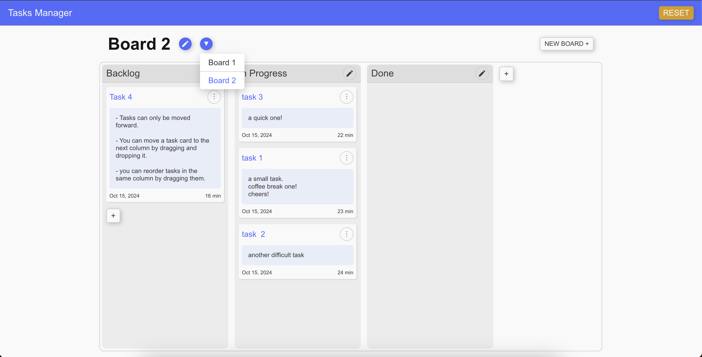

# Tasks Manager Project

This project is a task manager built using [Next.js](https://nextjs.org).

## Getting Started

To get the project up and running locally, follow these steps:

1. Install the required dependencies:

   ```bash
   npm i
   ```

2. Start the development server:

   ```bash
   npm run dev
   ```

3. Open [http://localhost:3000](http://localhost:3000) in your browser to see the application.



## Node Modules

Here are the key libraries used in this project:

- **styled-components**: For CSS-in-JS development, enabling scoped and dynamic styling.
- **react-dnd**: Core utilities for drag-and-drop functionality using hooks like `useDrag` and `useDrop`.
- **immer-js**: Facilitates immutable data handling while making updates to state simpler.
- **zod**: For robust data validation and schema definition.

## Folders

The important folders are located inside the main [**src**](./src) folder:

- **[app](./src/app/page.ts)**: The main entry point for routing.
- **[components](./src/components/)**: These components do not access application state directly. They receive data as props from parent components and may have their own local state.
- **[containers](./src/containers/)**: Components in this folder directly consume the application state. The main entry point is [RootContainer](./src/containers/RootContainer/index.tsx).
- **[contexts](./src/contexts/)**: This folder contains global providers like `AppStateProvider` for managing global state.

- **[lib](./src/lib/)**: Contains reusable libraries or utility components, such as [drag-and-drop](./src/lib/drag-and-drop/), designed for specific use cases.
  the dnd code base was cloned from an npm package [I published](https://www.npmjs.com/package/react-nested-dnd) a couple of years ago.

- **[ui](./src/ui/)**: Houses reusable UI components that ensure consistent styling across the project.

## Persistence

The project has two key components for data persistence:

- **[LocalStorageContainer](./src/containers/LocalStorageContainer/index.tsx)**: This component saves data to `localStorage` before page reloads and restores the saved data on initial render. However, note that the saved state is delayed since it is fetched from the client side.

- **[ServerStorageContainer](./src/containers/ServerStorageContainer/)**: Using Next.js’s "use server" notation, this component saves data on the server before reloads. The saved data from [server-storage](./src/server-storage/index.ts) is pre-fetched and passed to the state provider, making it available for use on the initial render.
